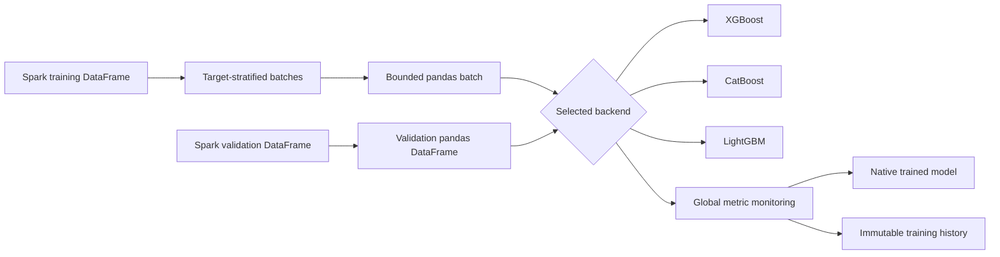

<div align="center">

# Spark Batch Trainer

### Gradient boosting on Spark DataFrames, without the `toPandas()` OOM

[](https://www.python.org/)
[](https://spark.apache.org/docs/latest/api/python/)
[](https://python-poetry.org/)
[](pyproject.toml)
[](#license)

**A focused Python library for training XGBoost, CatBoost, and LightGBM
classifiers on Spark DataFrames without collecting the full dataset into
driver memory.**

[Getting started](#requirements-and-installation) ·
[Backend guides](#xgboost-example) ·
[Architecture](#architecture) ·
[Documentation](https://manda404.github.io/SparkBatchTrainer/)

</div>

---

## Overview

Spark distributes ingestion, preprocessing, and feature engineering across a
cluster. XGBoost, CatBoost, and LightGBM do not participate in that
distribution: their scikit-learn-style APIs fit against a pandas DataFrame
held in the memory of a single process. Connecting the two normally means
calling `spark_df.toPandas()`, which collects the entire distributed dataset
into driver memory before a single training iteration runs.

On clusters sized for distributed ETL rather than single-node training, that
collection step is frequently what fails first — the driver runs out of
memory before training even starts, regardless of how well the upstream Spark
job scaled.

Spark Batch Trainer removes the need for a single full collection. Spark
performs target-stratified batch assignment and filtering; only the current
batch is ever collected as a pandas DataFrame, and each backend continues
training its booster from one batch to the next instead of fitting once
against a fully materialized dataset. Driver memory usage is governed by the
batch size and the validation set, not by the size of the full training
dataset.

> [!IMPORTANT]
> This is driver-side continuation training, not distributed model training.
> The complete validation dataset and one training batch must still fit in
> driver memory — batching reduces the memory constraint, it does not remove
> it.

## Contents

- [Why use it?](#why-use-it)
- [Supported backends](#supported-backends)
- [Requirements and installation](#requirements-and-installation)
- [Input contract](#input-contract)
- [Shared training configuration](#shared-training-configuration)
- [XGBoost example](#xgboost-example)
- [CatBoost example](#catboost-example)
- [LightGBM example](#lightgbm-example)
- [Training history and inference](#inspecting-training-history)
- [Multiclass configuration](#multiclass-configuration)
- [Architecture and semantics](#architecture)
- [Development and documentation](#development-and-validation)

## Why use it?

The straightforward alternative — call `toPandas()` once and fit a single
model against the fully collected DataFrame — works until the dataset grows
or the cluster shrinks. Driver memory does not scale with the rest of a Spark
job, so on a modest cluster it is usually the first resource exhausted,
producing an out-of-memory error before training begins rather than a
graceful degradation.

| Capability | What it provides |
| --- | --- |
| Bounded driver memory | Only one batch is materialized in pandas at a time; the full training dataset never needs to fit in driver memory. |
| Spark-native inputs | Training and validation start as Spark DataFrames. |
| Stratified batching | The target distribution remains approximately stable across batches. |
| Continuation training | Each backend continues its booster from one batch to the next. |
| Unified controls | Configuration, sample weighting, monitoring, and stopping share one vocabulary. |
| Lazy backends | Only the requested model SDK is imported. |
| Consistent history | Every backend returns the same immutable training-history structure. |

## How it works

The diagram below shows why only one bounded batch ever reaches the driver at
a time, instead of the whole training dataset:



The loop continues batch by batch until all batches are processed or global
early stopping is triggered.

## Supported backends

| Backend | Factory name | Returned model |
| --- | --- | --- |
| XGBoost | `xgboost` or `xgb` | `xgboost.XGBClassifier` |
| CatBoost | `catboost` or `cat` | `catboost.CatBoostClassifier` |
| LightGBM | `lightgbm`, `lgbm`, or `lgb` | `lightgbm.LGBMClassifier` |

## Requirements and installation

The project requires Python 3.11 or newer and a working Java environment for
PySpark.

```bash
git clone <repository-url>
cd SparkBatchTrainer
poetry install
```

Verify the installation:

```bash
poetry run python -c "import spark_batch_trainer; print(spark_batch_trainer.__version__)"
```

## Input contract

Before calling `fit`, prepare:

- a Spark training DataFrame;
- a Spark validation DataFrame;
- identical feature columns in both DataFrames;
- the same target column in both DataFrames;
- an integer-encoded target for multiclass workflows; and
- feature types supported by the selected model SDK.

Keep the test dataset separate. The validation dataset controls model
selection and must not be reused as the final unbiased test set.

```python
from pyspark.sql import SparkSession

spark = SparkSession.builder.appName("spark-batch-training").getOrCreate()

dataset = spark.read.option("header", True).option("inferSchema", True).csv(
    "data/churn.csv"
)

train_df, validation_df, test_df = dataset.randomSplit(
    [0.70, 0.15, 0.15], seed=42
)

target_column = "churn"
```

For grouped or temporal observations, replace `randomSplit` with a
domain-appropriate split to avoid entity or time leakage.

## Shared training configuration

The same `training_config` can be used with every backend:

```python
training_config = {
    "num_batches": 5,
    "max_patience": 3,
    "metric_mode": "min",
    "min_delta": 1e-4,
    "use_sample_weight": False,
    "show_learning_curve": False,
}
```

| Option | Purpose | Default |
| --- | --- | --- |
| `num_batches` | Number of target-stratified Spark batches | `10` |
| `max_patience` | Consecutive non-improving batches before stopping | `5` |
| `metric_mode` | Metric direction: `auto`, `min`, or `max` | `auto` |
| `min_delta` | Minimum change required to count as improvement | `0.0` |
| `use_sample_weight` | Enable balanced sample weights | `False` |
| `show_learning_curve` | Render the final learning curve | `False` |
| `monitor_metric` | Metric used for model selection when a backend reports several metrics | `None` |

Use `metric_mode="min"` for losses such as log loss and
`metric_mode="max"` for scores such as AUC. `auto` recognizes common metric
names, but an explicit value is safer for custom metrics.

## XGBoost example

```python
from spark_batch_trainer import create_trainer

xgboost_trainer = create_trainer("xgboost")
xgboost_trainer.fit(
    train_dataframe=train_df,
    valid_dataframe=validation_df,
    target_column=target_column,
    model_config={
        "objective": "binary:logistic",
        "eval_metric": "logloss",
        "n_estimators": 100,
        "learning_rate": 0.05,
        "max_depth": 6,
        "subsample": 0.8,
        "colsample_bytree": 0.8,
        "random_state": 42,
    },
    training_config=training_config,
    learning_rate_config={
        "initial_lr": 0.05,
        "decay_rate": 0.95,
        "min_lr": 0.005,
    },
)

xgboost_model = xgboost_trainer.get_trained_model()
xgboost_history = xgboost_trainer.get_training_history()
```

`learning_rate_config` is optional. When supplied, the learning rate is
updated between batches.

## CatBoost example

```python
from spark_batch_trainer import create_trainer

catboost_trainer = create_trainer("catboost")
catboost_trainer.fit(
    train_dataframe=train_df,
    valid_dataframe=validation_df,
    target_column=target_column,
    model_config={
        "loss_function": "Logloss",
        "eval_metric": "Logloss",
        "iterations": 100,
        "learning_rate": 0.05,
        "depth": 6,
        "random_seed": 42,
        "verbose": False,
    },
    training_config=training_config,
)

catboost_model = catboost_trainer.get_trained_model()
catboost_history = catboost_trainer.get_training_history()
```

Do not combine CatBoost's `auto_class_weights` with
`use_sample_weight=True`. Choose one class-balancing strategy to avoid applying
class correction twice.

## LightGBM example

```python
from spark_batch_trainer import create_trainer

lightgbm_trainer = create_trainer("lightgbm")
lightgbm_trainer.fit(
    train_dataframe=train_df,
    valid_dataframe=validation_df,
    target_column=target_column,
    model_config={
        "objective": "binary",
        "metric": "binary_logloss",
        "n_estimators": 100,
        "learning_rate": 0.05,
        "num_leaves": 31,
        "subsample": 0.8,
        "colsample_bytree": 0.8,
        "random_state": 42,
        "verbosity": -1,
    },
    training_config=training_config,
    learning_rate_config={
        "initial_lr": 0.05,
        "decay_rate": 0.95,
        "min_lr": 0.005,
    },
)

lightgbm_model = lightgbm_trainer.get_trained_model()
lightgbm_history = lightgbm_trainer.get_training_history()
```

## Inspecting training history

Every trainer exposes the same read-only history object:

```python
history = xgboost_trainer.get_training_history()

for batch_number, train_scores, validation_scores in zip(
    history.batch_numbers,
    history.train_scores,
    history.validation_scores,
):
    print(
        f"batch={batch_number} "
        f"train={train_scores[-1]:.5f} "
        f"validation={validation_scores[-1]:.5f}"
    )
```

The history contains the metric sequences reported by the backend for each
processed batch. A batch can contain several boosting iterations.

## Bounded inference example

The returned object is the native backend model. Its `predict` method expects
in-memory features rather than a Spark DataFrame.

```python
prediction_sample = test_df.limit(100).toPandas()
features = xgboost_trainer.prepare_features(prediction_sample)

predictions = xgboost_model.predict(features)
```

> [!WARNING]
> Keep inference collection explicitly bounded. Calling `toPandas()` on an
> unrestricted Spark DataFrame can exhaust driver memory. Use a separate
> distributed inference workflow for production-scale scoring.

## Multiclass configuration

The workflow is identical for multiclass classification, but the target must
be encoded as integer class identifiers and the backend configuration must
declare the correct objective.

```python
xgboost_config = {
    "objective": "multi:softprob",
    "num_class": number_of_classes,
    "eval_metric": "mlogloss",
}

catboost_config = {
    "loss_function": "MultiClass",
    "eval_metric": "MultiClass",
}

lightgbm_config = {
    "objective": "multiclass",
    "num_class": number_of_classes,
    "metric": "multi_logloss",
}
```

## Direct class imports

The factory is recommended when the backend is selected dynamically. Direct
imports are also part of the public API:

```python
from spark_batch_trainer import (
    CatBoostTrainer,
    LightGBMTrainer,
    XGBoostTrainer,
)
```

## Architecture

```text
src/spark_batch_trainer/
├── __init__.py         # public API and lazy backend imports
├── factory.py          # backend selection
├── backends/           # model-specific adapters
├── data/               # Spark batching and pandas preparation
└── training/           # lifecycle, configuration, metrics, and history
```

Dependency direction:

```text
public API -> factory -> selected backend -> model SDK
                              |-> data
                              |-> training
```

Backend-independent modules do not import XGBoost, CatBoost, or LightGBM.

## Training semantics

Spark Batch Trainer performs continuation training, not online learning. A
backend retains the previous booster while fitting the next batch. Results can
depend on batch order and are not mathematically identical to one fit over the
complete dataset.

Global early stopping compares validation results after each batch. It does
not replace every backend-specific convergence mechanism inside an individual
fit.

## Current limitations

- Model fitting runs on the Python driver, not on Spark executors.
- The complete validation dataset is collected in driver memory.
- One training batch can still exceed available driver memory.
- Model persistence is delegated to each native model SDK.
- The package currently documents classification workflows only.
- Large-scale distributed inference is outside the current public API.

## Development and validation

```bash
poetry run pytest
poetry run black --check src utils tests
poetry run ruff check src utils tests
poetry run mypy src utils
poetry run pytest
poetry run sphinx-build -W --keep-going -b html docs/source docs/build/html
```

The test suite separates backend-independent unit tests from Spark integration
tests that exercise XGBoost, CatBoost, and LightGBM.

## Documentation

The complete documentation is available on
[GitHub Pages](https://manda404.github.io/SparkBatchTrainer/).

- [Installation guide](docs/source/usage/installation.rst)
- [Practical training guide](docs/source/usage/tutorials.rst)
- [Configuration reference](docs/source/configuration.rst)
- [Architecture](docs/source/architecture.rst)
- [API reference](docs/source/api/index.rst)
- [Binary classification notebook](notebooks/01_binary_classification.ipynb)
- [Multiclass classification notebook](notebooks/02_multiclass_classification.ipynb)

## License

This project is distributed under the MIT License.
