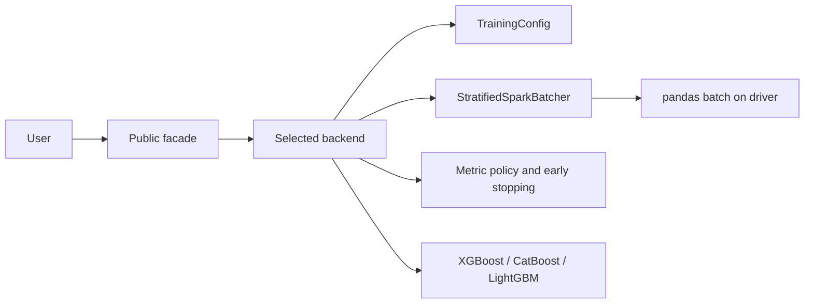

# Current Architecture

Spark Batch Trainer is a driver-side training orchestrator. Spark assigns and filters stratified batches; each selected batch is converted to pandas and trained by a local model SDK.

The architecture deliberately does not claim distributed model training. The full validation set and each individual batch must fit in driver memory. Backends still contain some duplicated orchestration and a mutable runtime dictionary; both are tracked as remaining debt.
