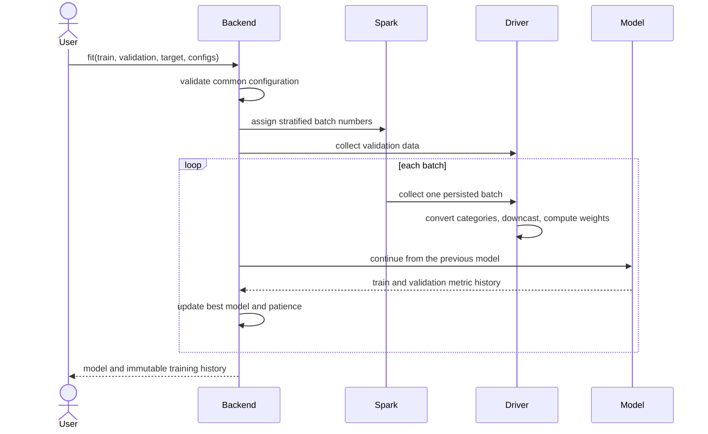

# Training Workflow

Batch assignment is persisted with `MEMORY_AND_DISK` and released in a `finally` block. Global early stopping compares the last configured metric after every batch. Known score metrics are maximized, losses are minimized, and custom metrics can declare an explicit direction.
