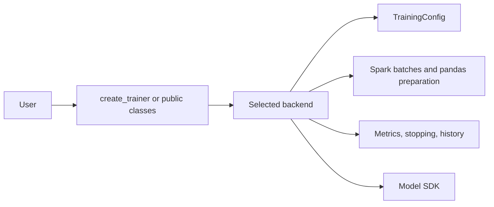

# Accessible Professional Architecture

## Design rule

A contributor should find behavior by intent without knowing the project's history. The structure therefore uses direct domain terms: configuration, data, evaluation, backends, visualization, and observability.



| Package | Responsibility |
|---|---|
| `config` | Validate shared user options before Spark actions |
| `data` | Assign Spark batches, collect pandas data, optimize memory, compute weights |
| `evaluation` | Compare metrics, stop globally, expose immutable history |
| `backends` | Implement SDK-specific continuation and evaluation calls |
| `visualization` | Render optional plots without coupling training to Matplotlib |
| `observability` | Configure console and optional rotating file logs |
| `trainer.py` | Provide the simple `create_trainer()` factory |

## Recommended API

```python
from spark_batch_trainer import create_trainer

trainer = create_trainer("lightgbm")
trainer.fit(
    train_dataframe=train_df,
    valid_dataframe=validation_df,
    target_column="target",
    model_config={},
    training_config={"num_batches": 5},
)
model = trainer.get_trained_model()
history = trainer.get_training_history()
```

The redundant `trainers`, `logger`, `config`, `evaluation`, `visualization`,
`observability`, and old `core` compatibility packages have been removed.
New code should use the package root, `backends`, `data`, and `training` only.
