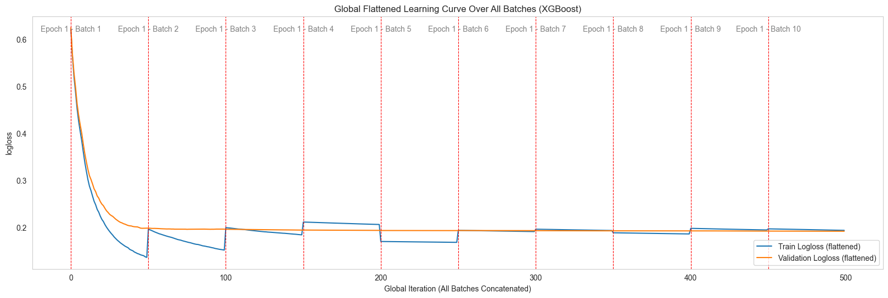
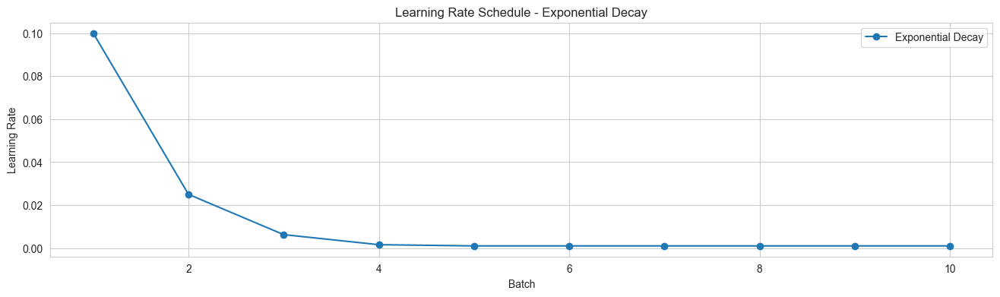
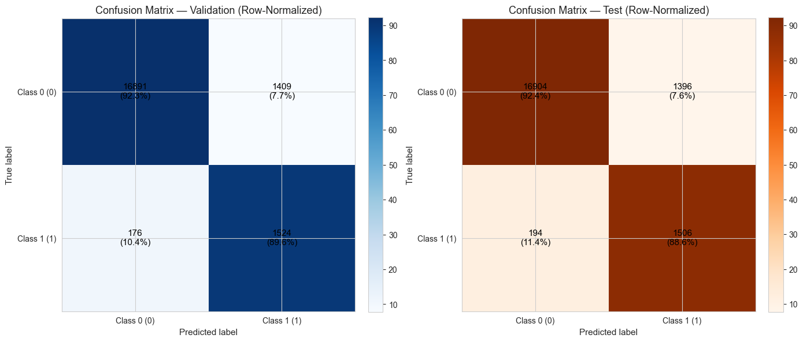
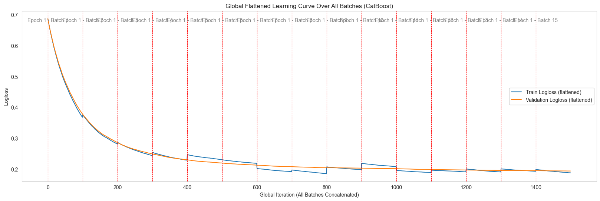
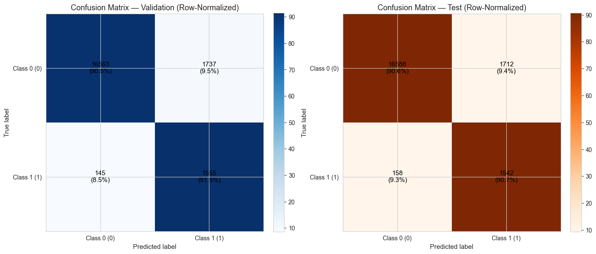
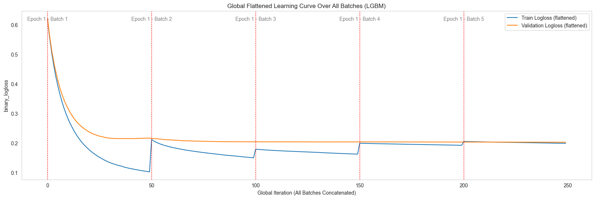
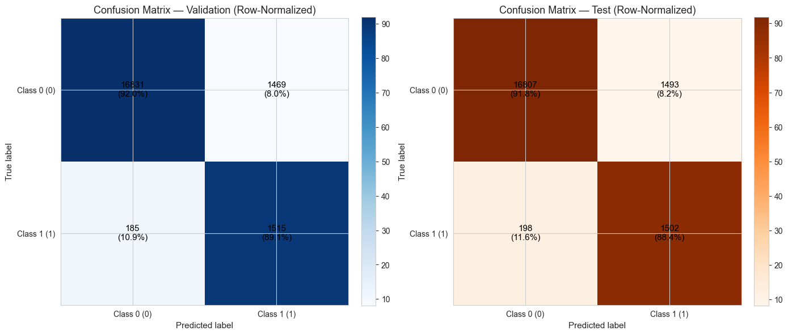

Binary Classification Examples
==============================

Cette page illustre l’utilisation de **Spark Batch Trainer**
pour un problème de **classification binaire**, en s’appuyant sur le
:doc:`dataset_overview` (Diabetes Dataset).  

📌 Objectif : prédire si un patient est diabétique à partir de ses données médicales.  

.. note::

   La préparation des données (chargement, découpage en train/validation/test,
   conversion en Spark DataFrames) est déjà décrite en détail dans la section
   :doc:`dataset_overview`.  

   Dans les exemples ci-dessous, nous supposons que `spark_train_df` et
   `spark_valid_df` sont déjà disponibles et prêts à l’emploi.

---

1. XGBoost Example (Binary Classification)
------------------------------------------

.. code-block:: python

    from spark_batch_trainer.trainers.xgboost_trainer import XGBoostTrainer

    # 1. Instanciation
    trainer = XGBoostTrainer()
    target_column = "diabetes"

    # 2. Configuration du modèle
    config_model = {
        "objective": "binary:logistic",   # Tâche = classification binaire
        "eval_metric": "logloss",         # Métrique de suivi
        "n_estimators": 50,               # Nombre d’arbres
        "learning_rate": 0.05,            # Taux d’apprentissage
        "max_depth": 6,                   # Profondeur max
        "reg_lambda": 3.0,                # Régularisation L2
        "subsample": 0.8,                 # Sous-échantillonnage des données
        "colsample_bytree": 0.8,          # Sous-échantillonnage des features
        "random_state": 42,               # Reproductibilité
        "early_stopping_rounds": 50,      # Arrêt anticipé
    }

    # 3. Scheduler du learning rate
    config_lr_scheduler = {
        "initial_lr": 0.1,   # LR initial
        "decay_rate": 0.25,  # Facteur de réduction
        "min_lr": 1e-3,      # LR minimal
    }

    # 4. Entraînement batch-wise
    config_training = {
        "num_batches": 10,              # Nombre de lots
        "max_patience": 2,              # Patience early stopping global
        "show_learning_curve": True,    # Afficher la courbe d’apprentissage
        "use_sample_weight": True,      # Gestion pondérations
    }

    # 5. Fit & Evaluation
    trainer.fit(
        train_dataframe=spark_train_df,
        valid_dataframe=spark_valid_df,
        target_column=target_column,
        config_training=config_training,
        config_model=config_model,
        config_lr_scheduler=config_lr_scheduler,
    )

    # 6. Récupération modèle entraîné
    trained_model = trainer.get_trained_model()

Résultats visuels
~~~~~~~~~~~~~~~~~

---

2. CatBoost Example (Binary Classification)
------------------------------------------

.. code-block:: python

    from spark_batch_trainer.trainers.catboost_trainer import CatBoostTrainer

    # 1. Instanciation
    trainer = CatBoostTrainer()
    target_column = "diabetes"

    # 2. Configuration du modèle
    config_model = {
        "loss_function": "Logloss",       # Tâche binaire
        "eval_metric": "Logloss",         # Métrique de suivi
        "iterations": 100,                # Nombre d’itérations
        "learning_rate": 0.01,            # Taux d’apprentissage
        "depth": 6,                       # Profondeur max
        "l2_leaf_reg": 3.0,               # Régularisation
        "auto_class_weights": "Balanced", # Gestion classes déséquilibrées
        "bootstrap_type": "Bernoulli",    # Type de bootstrap
        "subsample": 0.8,                 # Sous-échantillonnage
        "random_seed": 42,                # Reproductibilité
        "verbose": False,                 # Logs silencieux
    }

    # 3. Entraînement batch-wise
    config_training = {
        "num_batches": 15,              # Nombre de lots
        "max_patience": 3,              # Patience early stopping global
        "show_learning_curve": True,    # Afficher la courbe d’apprentissage
    }

    # 4. Fit & Evaluation
    trainer.fit(
        train_dataframe=spark_train_df,
        valid_dataframe=spark_valid_df,
        target_column=target_column,
        config_training=config_training,
        config_model=config_model,
    )

    # 5. Récupération modèle entraîné
    trained_model = trainer.get_trained_model()

Résultats visuels
~~~~~~~~~~~~~~~~~

---

3. LightGBM Example (Binary Classification)
------------------------------------------

.. code-block:: python

    from spark_batch_trainer.trainers.lightgbm_trainer import LGBMTrainer

    # 1. Instanciation
    trainer = LGBMTrainer()
    target_column = "diabetes"

    # 2. Configuration du modèle
    config_model = {
        "objective": "binary",    # Tâche binaire
        "n_estimators": 50,       # Nombre d’arbres
        "num_leaves": 30,         # Nombre de feuilles
        "random_state": 42,       # Reproductibilité
        "force_col_wise": True,   # Optimisation mémoire
    }

    # 3. Scheduler du learning rate
    config_lr_scheduler = {
        "initial_lr": 0.1,   # LR initial
        "decay_rate": 0.25,  # Facteur de réduction
        "min_lr": 1e-3,      # LR minimal
    }

    # 4. Entraînement batch-wise
    config_training = {
        "num_batches": 5,               # Nombre de lots
        "max_patience": 2,              # Patience early stopping global
        "eval_metric": "binary_logloss",# Métrique de suivi
        "show_learning_curve": True,    # Afficher la courbe d’apprentissage
        "use_sample_weight": True,      # Gestion pondérations
    }

    # 5. Fit & Evaluation
    trainer.fit(
        train_dataframe=spark_train_df,
        valid_dataframe=spark_valid_df,
        target_column=target_column,
        config_training=config_training,
        config_model=config_model,
        config_lr_scheduler=config_lr_scheduler,
    )

    # 6. Récupération modèle entraîné
    trained_model = trainer.get_trained_model()

Résultats visuels
~~~~~~~~~~~~~~~~~

.. image:: ../_static/binarylabel/lightgbm_exponential_decay_lr.png
   :alt: Évolution du learning rate avec décroissance exponentielle (LightGBM)
   :align: center
   :width: 900px
   :height: 250px

---