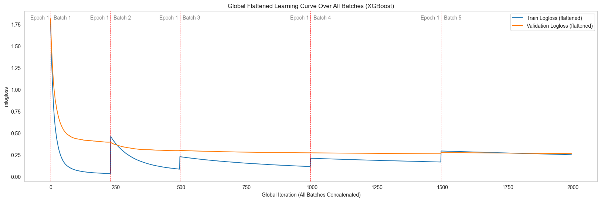
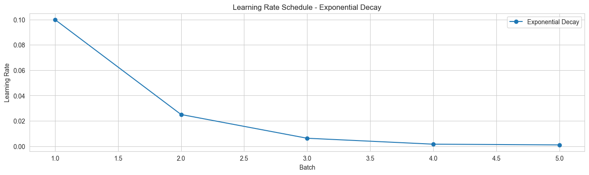
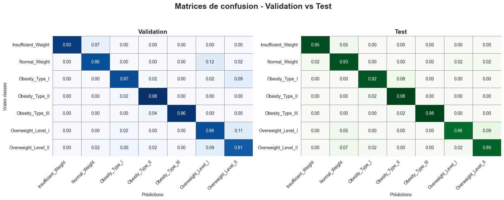
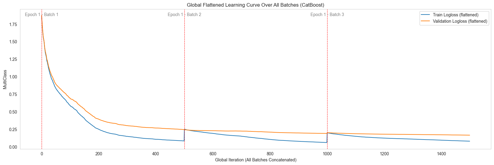
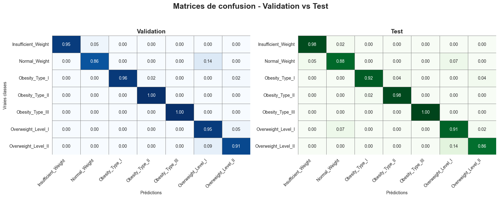
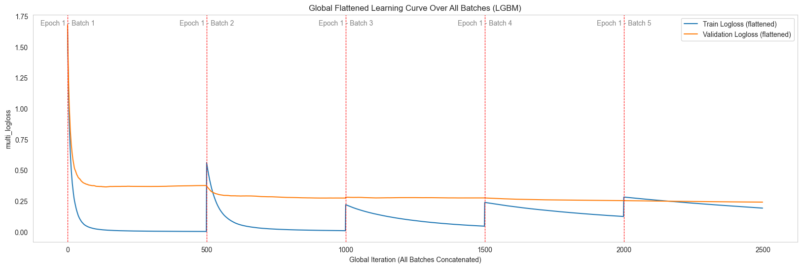

Multiclass Classification
=========================

This page demonstrates the use of **Spark Batch Trainer**
for a **multiclass classification** problem, using the
:doc:`dataset_overview` (Obesity Dataset).  

📌 **Goal**: Predict the **obesity category** of an individual based on
demographic and behavioral features.

.. note::

   Data preparation (loading, splitting into train/validation/test,
   converting to Spark DataFrames) is described in detail in the
   :doc:`dataset_overview` section.  

   In the examples below, we assume that `spark_train_df` and
   `spark_valid_df` are already available and ready to use.

---

1. XGBoost Example
------------------

**Summary**:  
This example shows how to train an **XGBoost** model for multiclass classification
with batch-wise training and exponential decay learning rate scheduling.  
XGBoost provides strong performance on tabular datasets and supports flexible multiclass objectives.  

.. code-block:: python

    from spark_batch_trainer.trainers.xgboost_trainer import XGBoostTrainer

    # 1. Instantiate trainer
    trainer = XGBoostTrainer()
    target_column = "NObeyesdad"   # Multiclass target column

    # 2. Define model configuration
    config_model = {
        "objective": "multi:softprob",
        "eval_metric": "mlogloss",
        "n_estimators": 500,
        "learning_rate": 0.05,
        "max_depth": 6,
        "reg_lambda": 3.0,
        "subsample": 0.8,
        "colsample_bytree": 0.8,
        "random_state": 42,
        "early_stopping_rounds": 10,
    }

    # 3. Set learning rate scheduler
    config_lr_scheduler = {
        "initial_lr": 0.1,
        "decay_rate": 0.25,
        "min_lr": 1e-3,
    }

    # 4. Configure batch-wise training
    config_training = {
        "num_batches": 2,
        "max_patience": 1,
        "show_learning_curve": True,
        "use_sample_weight": True,
        "verbose": 100,
    }

    # 5. Fit and evaluate
    trainer.fit(
        train_dataframe=spark_train_df,
        valid_dataframe=spark_valid_df,
        target_column=target_column,
        config_training=config_training,
        config_model=config_model,
        config_lr_scheduler=config_lr_scheduler,
    )

    # 6. Retrieve trained model
    trained_model = trainer.get_trained_model()

**Visual Results (XGBoost)**  

- **Learning curve**: training vs validation multiclass logloss  
- **Learning rate schedule**: exponential decay applied  
- **Confusion matrix**: classification results across all 7 obesity categories  

---

2. CatBoost Example
-------------------

**Summary**:  
This example shows how to train a **CatBoost** model for multiclass classification
with batch-wise training.  
CatBoost is highly effective for datasets with categorical features and 
handles class imbalance automatically.  

.. code-block:: python

    from spark_batch_trainer.trainers.catboost_trainer import CatBoostTrainer

    # 1. Instantiate trainer
    trainer = CatBoostTrainer()
    target_column = "NObeyesdad"

    # 2. Define model configuration
    config_model = {
        "loss_function": "MultiClass",
        "eval_metric": "MultiClass",
        "iterations": 500,
        "learning_rate": 0.05,
        "depth": 6,
        "l2_leaf_reg": 3.0,
        "auto_class_weights": "Balanced",
        "bootstrap_type": "Bernoulli",
        "subsample": 0.8,
        "random_seed": 42,
        "verbose": 100,
    }

    # 3. Configure batch-wise training
    config_training = {
        "num_batches": 3,
        "max_patience": 2,
        "show_learning_curve": True,
    }

    # 4. Fit and evaluate
    trainer.fit(
        train_dataframe=spark_train_df,
        valid_dataframe=spark_valid_df,
        target_column=target_column,
        config_training=config_training,
        config_model=config_model,
    )

    # 5. Retrieve trained model
    trained_model = trainer.get_trained_model()

**Visual Results (CatBoost)**  

- **Learning curve**: training vs validation multiclass logloss  
- **Confusion matrix**: predictions across the 7 obesity classes  

---

3. LightGBM Example
-------------------

**Summary**:  
This example shows how to train a **LightGBM** model for multiclass classification
with batch-wise training and exponential decay learning rate scheduling.  
LightGBM is optimized for **speed and memory efficiency**, making it well-suited
for larger datasets with multiple classes.  

.. code-block:: python

    from spark_batch_trainer.trainers.lightgbm_trainer import LGBMTrainer

    # 1. Instantiate trainer
    trainer = LGBMTrainer()
    target_column = "NObeyesdad"

    # 2. Define model configuration
    config_model = {
        "objective": "multiclass",
        "metric": "multi_logloss",
        "num_class": 7,
        "n_estimators": 500,
        "num_leaves": 31,
        "learning_rate": 0.05,
        "max_depth": -1,
        "reg_lambda": 1.0,
        "subsample": 0.8,
        "colsample_bytree": 0.8,
        "random_state": 42,
        "force_col_wise": True,
        "verbose": -1,
    }

    # 3. Set learning rate scheduler
    config_lr_scheduler = {
        "initial_lr": 0.1,
        "decay_rate": 0.25,
        "min_lr": 1e-3,
    }

    # 4. Configure batch-wise training
    config_training = {
        "num_batches": 5,
        "max_patience": 2,
        "show_learning_curve": True,
        "use_sample_weight": True,
        "eval_metric": "multi_logloss",
    }

    # 5. Fit and evaluate
    trainer.fit(
        train_dataframe=spark_train_df,
        valid_dataframe=spark_valid_df,
        target_column=target_column,
        config_training=config_training,
        config_model=config_model,
        config_lr_scheduler=config_lr_scheduler,
    )

    # 6. Retrieve trained model
    trained_model = trainer.get_trained_model()

**Visual Results (LightGBM)**  
- **Learning curve**: training vs validation multiclass logloss  
- **Learning rate schedule**: exponential decay applied  
- **Confusion matrix**: classification performance across the 7 categories  

.. image:: ../_static/multilabel/lightgbm_exponential_decay_lr.png
   :alt: Learning rate schedule with exponential decay (LightGBM)
   :align: center
   :width: 900px
   :height: 250px

---

Key Takeaways
-------------

- Spark Batch Trainer supports **multiclass classification** with **XGBoost**, **CatBoost**, and **LightGBM**.  
- Batch-wise training enables **global early stopping** and real-time monitoring.  
- Learning rate scheduling (e.g., **exponential decay**) helps improve convergence stability.  
- Each framework brings unique benefits:  

  - **XGBoost**: flexible and reliable for multiclass tabular problems.  
  - **CatBoost**: strong with categorical features, automatically handles class imbalance.  
  - **LightGBM**: highly efficient, optimized for large and complex datasets.  
